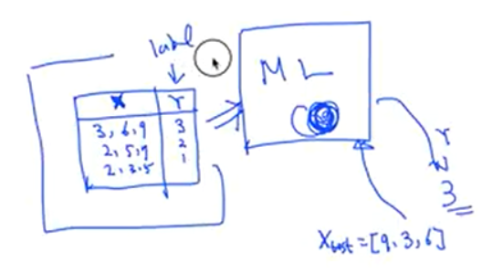
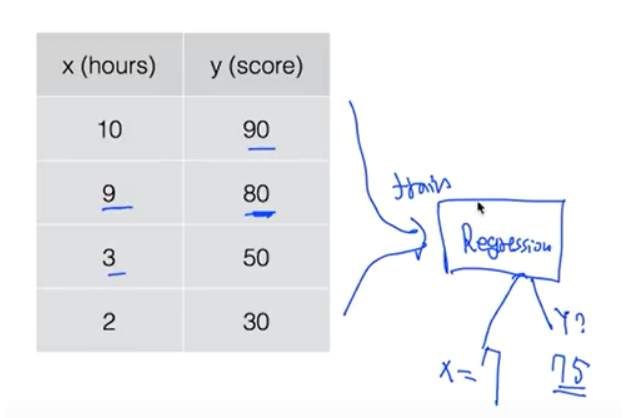
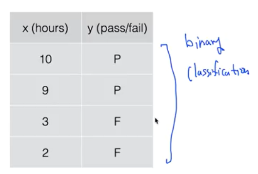
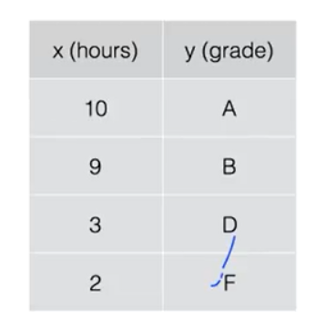

### Lec 01: 기본적인 Machine Learning 의 용어와 개념 설명

---

#### 머신러닝

- Arthur Samuel(1959) / 컴퓨터가 배우고 학습하는 능력을 갖는것
- 등장 배경: 명시적 프로그래밍의 한계로 인해 등장

#### 구현 방법

1. Supervised Learning : 정해져 있는 데이터(training set)을 기반으로 학습하는 방법
   - ex) 이미지 분류(labeling), 이메일 스팸 필터링, 시험 점수 예측 등
   - Training set으로 학습한 내용을 배경으로 test data를 입력 받았을때 결과를 예측하는 방식
     - Training data set : 머신러닝 모델이 학습하는 데이터
     - 
   - 종류
     - Regression(회귀) : 예측 값이 float 형태일 때 예측하는 것 (시험점수 예측)
     - 시험공부한 시간을 바탕으로 시험 점수 예측
     - 
     - Binary classification : pass/non-pass를 예측하는 것
     - 시험공부한 시간을 바탕으로 pass/fail 예측
     - 
     - Multi-label classification : Binary classification과 하나만 선택하는 것은 동일하지만, label이 여러개 있음 (학점 예측)
     - 시험공부한 시간을 바탕으로 A, B, C, D, F 등 등급 예측
     - 

2. Unsupervised Learning : un-labeled data로 학습하는 방법 (Google news grouping, Word clustering)

---

