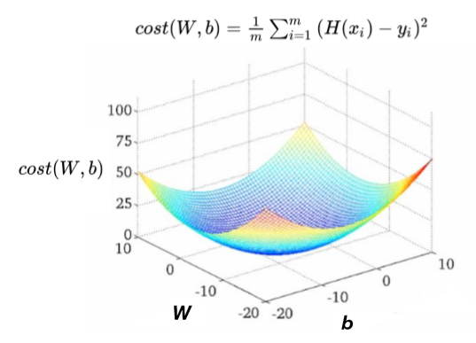

### Lec 03: Linear Regression and How to minimize cost

---

#### Gradient Descent Algorithm

- Basic
  - 정의 : 경사를 따라 내려가며 최저점을 찾는 알고리즘
  - 목표 : cost를 최소화하는 W,b 값을 찾기 위해 사용
  - 장점 : 변수가 여럿이어도 사용 가능
  - 동작 과정
    1. 초기 W,b 값 설정 (cost function 그래프 상 임의의 한 점)
    2. cost가 줄어드는 방향(기울기 값을 구해서 cost가 최소화 될 수 있도록)으로 W,b 값을 지속적으로 update
    3. cost가 최저점에 도달했다고 판단될 때까지 반복

<br>

- 기존의 Hypothesis와 Cost를 간략화

  - 

- Hypothesis에 따른 cost 변화

  - 

- Gradient descent algorithm 동작 과정

  - 
  - 

  - 한 step을 움직일 때, 기울기 비례로 이동한다. 즉 기울기가 가파를 수록 더욱 많이 이동한다.
  - Gradient는 미분으로 구할 때, 간편한 계산을 위한 식 변화 (평균을 구할때 분모의 계수는 몇이여도 상관없는데, 미분했을때 약분되게 하기 위해 2로 설정)
  - 
  - 미분 과정 (알파 = learning rate)
    - learning rate: W를 변화시킬 폭을 결정
      - 크다: W값의 변화폭이 크다
      - 작다: W값의 변화폭이 작다
    - 
  - Gradient descent 한계점 (다음과 같은 그림에서는 시작점에 따라 최적의 cost를 찾을 수 없다.)
  - 
  - 다음 그림에서만 가능함
  - 

---

<br>

### Lab 03: Linear Regression and How to minimize cost 를 TensorFlow 로 구현하기

---

- cost function을 python으로 구현

  ```python
  import numpy as np
  
  X = np.array([1, 2, 3])
  Y = np.array([1, 2, 3])
  
  def cost_func(W, X, Y):
      c = 0
      
      # c = (예측값 - 실제값)의 제곱의 합
      for i in range(len(X)):
          c += (W * X[i] - Y[i]) ** 2
          
      # (예측값 - 실제값)의 제곱의 합의 평균 리턴
      return c / len(X)
  
  # W를 -3 ~ 5까지 15구간으로 나눠 cost값 출력
  for feed_W in np.linspace(-3, 5, num=15):
      curr_cost = cost_func(feed_W, X, Y)
      print("{:6.3f} | {:10.5f}".format(feed_W, curr_cost))
  ```

  ```
  -3.000 |   74.66667
  -2.429 |   54.85714
  -1.857 |   38.09524
  -1.286 |   24.38095
  -0.714 |   13.71429
  -0.143 |    6.09524
   0.429 |    1.52381
   1.000 |    0.00000
   1.571 |    1.52381
   2.143 |    6.09524
   2.714 |   13.71429
   3.286 |   24.38095
   3.857 |   38.09524
   4.429 |   54.85714
   5.000 |   74.66667
  ```

- gradient descent를 tensorflow로 구현

  ```python
  import tensorflow as tf
  tf.enable_eager_execution()
  
  tf.set_random_seed(0)
  
  x_data = [1., 2., 3., 4.]
  y_data = [1., 3., 5., 7.]
  
  W = tf.Variable(tf.random_normal([1], -100., 100.))
  
  for step in range(300):
      hypothesis = W * X
      cost = tf.reduce_mean(tf.square(hypothesis - Y))
      
      alpha = 0.01
      gradient = tf.reduce_mean(tf.multiply(tf.multiply(W, X) - Y, X))
      descent = W - tf.multiply(alpha, gradient)
      W.assign(descent)
      
      if step % 10 == 0:
          print('{:5} | {:10.4f} | {:10.6f}'.format(step, cost.numpy(), W.numpy()[0]))
  ```

  ```
      0 | 11716.3086 |  48.767971
     10 |  4504.9126 |  30.619968
     20 |  1732.1364 |  19.366755
     30 |   666.0052 |  12.388859
     40 |   256.0785 |   8.062004
     50 |    98.4620 |   5.379007
     60 |    37.8586 |   3.715335
     70 |    14.5566 |   2.683725
     80 |     5.5970 |   2.044044
     90 |     2.1520 |   1.647391
    100 |     0.8275 |   1.401434
    110 |     0.3182 |   1.248922
    120 |     0.1223 |   1.154351
    130 |     0.0470 |   1.095710
    140 |     0.0181 |   1.059348
    150 |     0.0070 |   1.036801
    160 |     0.0027 |   1.022819
    170 |     0.0010 |   1.014150
    180 |     0.0004 |   1.008774
    190 |     0.0002 |   1.005441
    200 |     0.0001 |   1.003374
    210 |     0.0000 |   1.002092
    220 |     0.0000 |   1.001297
    230 |     0.0000 |   1.000804
    240 |     0.0000 |   1.000499
    250 |     0.0000 |   1.000309
    260 |     0.0000 |   1.000192
    270 |     0.0000 |   1.000119
    280 |     0.0000 |   1.000074
    290 |     0.0000 |   1.000046
  ```

  - W값이 변화하며 cost가 줄어들고 있다.

- cost는 0으로 수렴하고, W는 특정 값으로 수렴하는 것을 알 수 있다.

  - 

---

