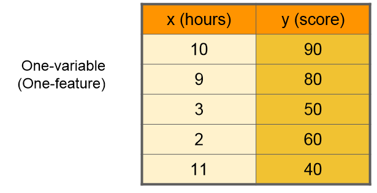
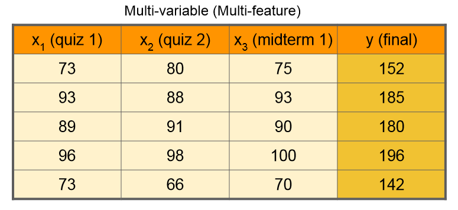
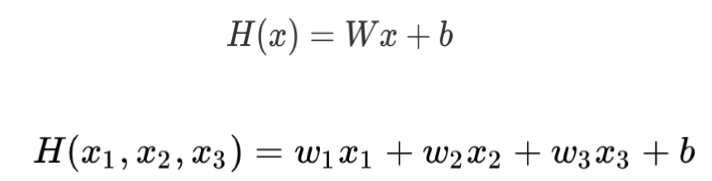
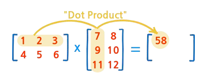
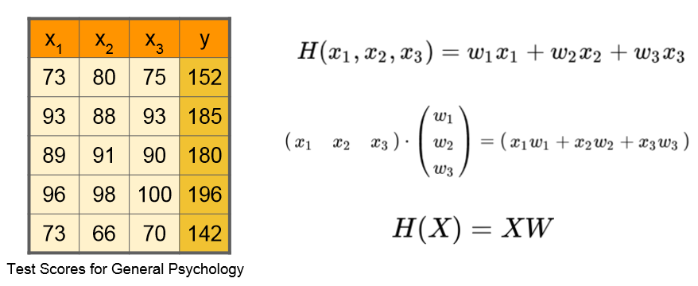
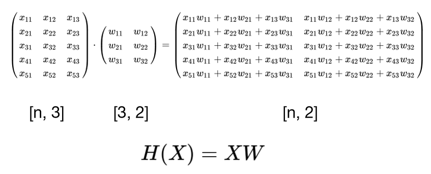
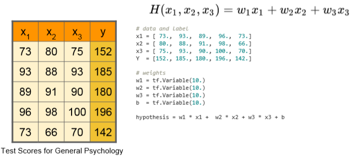
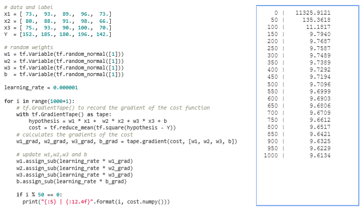
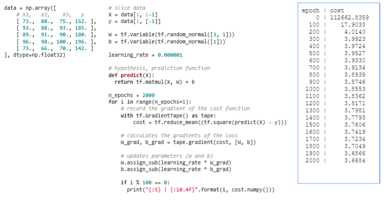
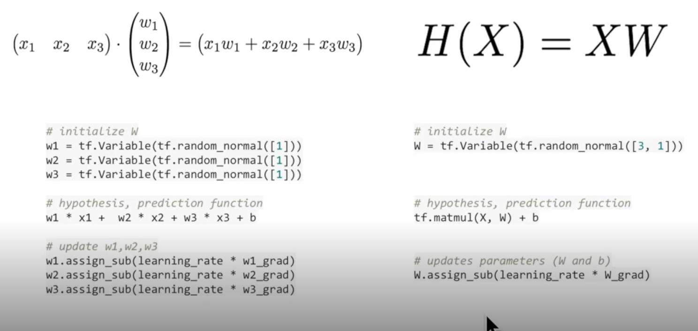

### Lec 04: Multi-variable Linear Regression

---

- Basic
  - 변수 갯수가 늘어나면 가중치 갯수도 그만큼 늘어난다
  - 행렬 곱(Dot product)을 통해 간결하게 표현: H(X) = XW
  - 행, 열 갯수 중요: X의 열 갯수와 W의 행 갯수가 일치해야 행렬 곱 가능
    - W의 행 갯수 = 입력 데이터의 열 갯수, W의 열 갯수 = 결과 데이터의 열 갯수

 

- 변수가 하나일 때
- 
- 변수가 여러개 일때
- 
- 변수가 여러개 일 때 Hypothesis
- 
- 변수의 간편화를 위한 Dot Product
- 
- 행렬을 이용한 Hypothesis
- 
- Matrix 사용 이점 : 데이터 개수에 상관없이 동일한 Hypothesis를 이용할 수 있다.
- 

---

 

### Lab 04: Multi-variable Linear Regression 를 TensorFlow 로 구현하기

---

- 데이터 준비
- 
- Gradient Descent Algorithm
- 
- numpy를 사용한 구현
- 
- Matrix를 사용했을 때의 이점
- 

---

