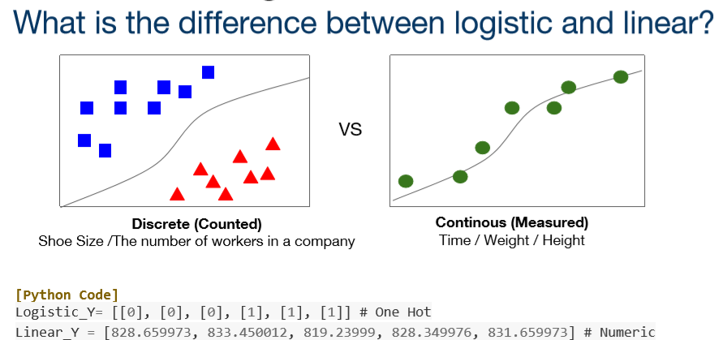
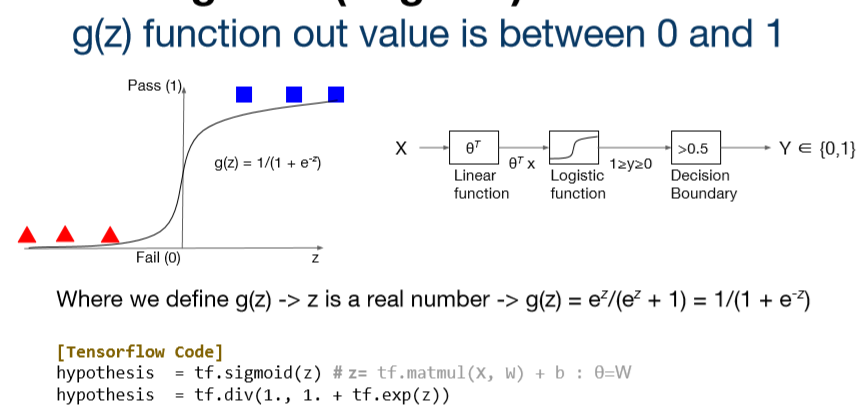
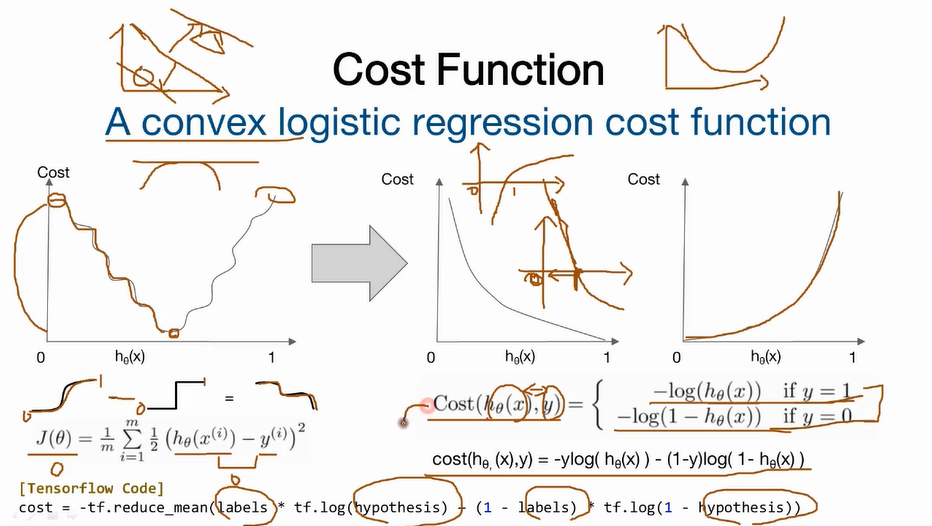
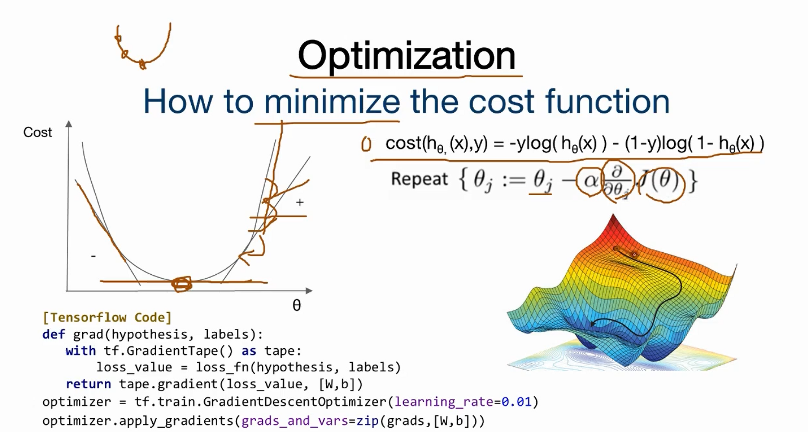
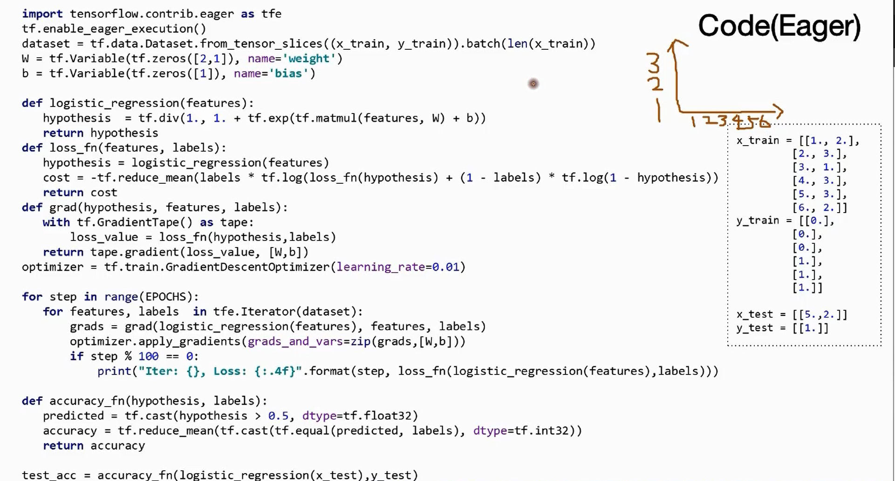
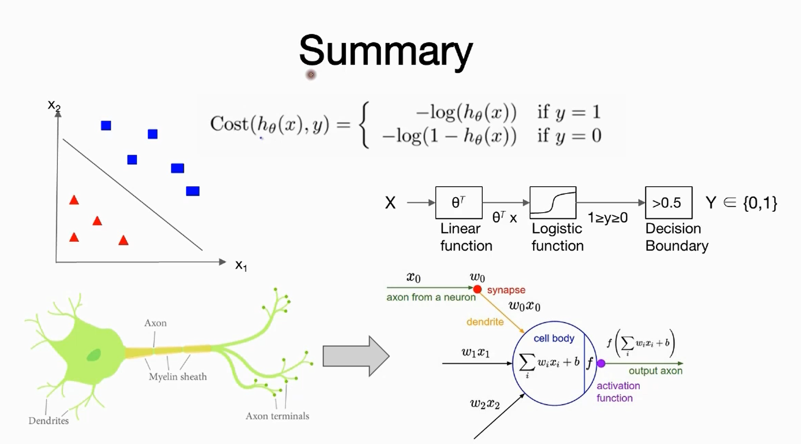

### Lec 05-1 Logistic Regression Classification 의 소개

---

- Basic
  - 데이터를 구분하기 위해 사용(classification)
  - 적용 가능한 데이터들의 특징: binary classification이 가능한 데이터
  - Linear Regression과의 차이
    - Linear Regression: 데이터들이 연속적이다. (Numeric)
    - Logistic Regression: 데이터가 흩어져있고 구분이 가능하다(One hot)
  - 데이터를 Logistic Function으로 나타낸 후 decision boundary를 적용해 classification 실행
  - Neural Network의 하나의 component

 

- Logistic Regression
- Binary Classification (0:positive / 1:negative)
- Logistic vs Linear
- 
- Linear Function으로 나온 예측 값을 Sigmoid(Logistic) Function을 통해 0과 1로 변환할 수 있음
- linear regression을 통해 얻은 값을 sigmoid function을 통해 0, 1로 변환한다.
  - 
- Decision Boundary :  0과 1을 구분하는 범위 (데이터 구분을 위한 경계)
  - linear / non-linear function 관계없이 설정 가능
- Cost Function
  - 초기의 random한 W값을 fitting하기 위함
  - Sigmoid Function의 값 - binary classification한 값이므로 그래프의 형태가 구부러진 형태가 된다
  - 형태
    - 예측값이 1이면: cost(h(x), y) = -log(h(x))
    - 예측값이 0이면: cost(h(x), y) = -log(1 - h(x))
  - 
  - Convex하게 만들기 위해, log 함수를 이용한다.
- Optimization
- Gradient Descent를 통해 최적화
  - 
- Logistic Regression 전체 코드
- 
- Summary
- 

---

